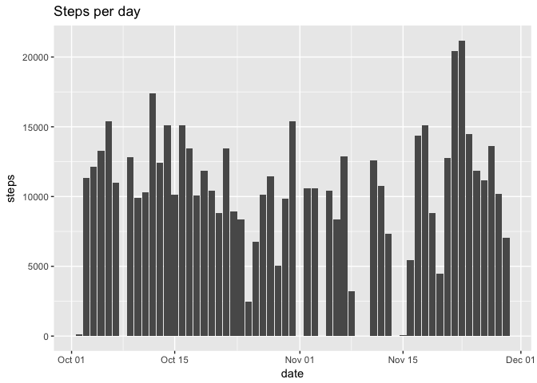
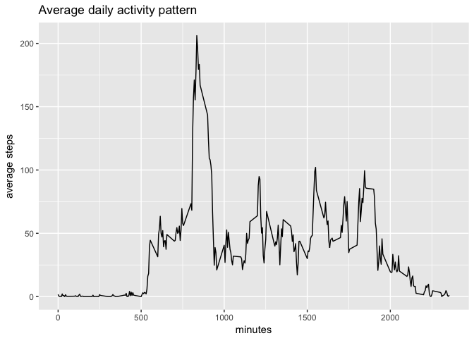
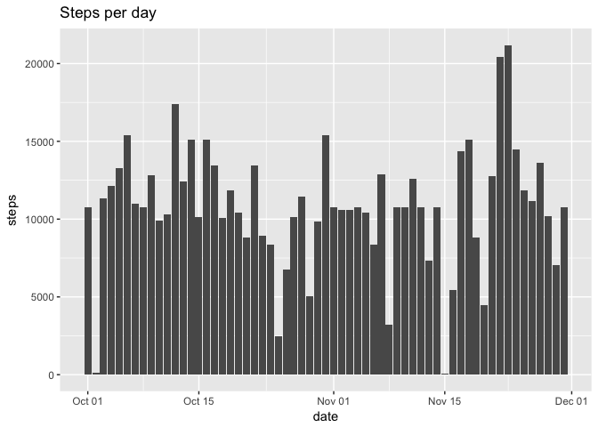
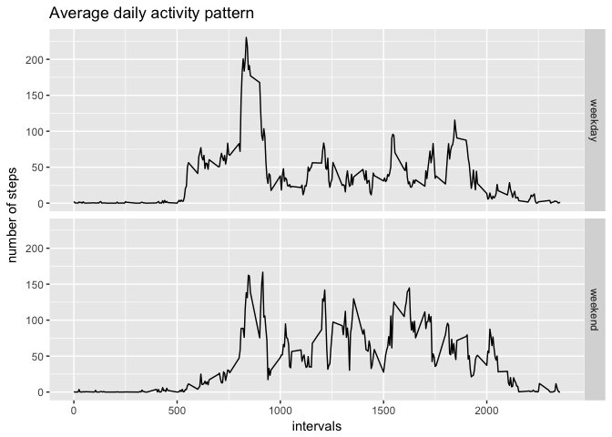

```r
library(dplyr)
library(ggplot2)
```


## Loading and preprocessing the data

```r
d = read.csv("activity.csv")
# convert date column
d[,"date"] <- as.Date(d[,"date"])
```

```
## Warning in strptime(xx, f <- "%Y-%m-%d", tz = "GMT"): unknown timezone
## 'default/Europe/Paris'
```


## What is mean total number of steps taken per day?

```r
# remove NA rows
stepsPerDay = d[!is.na(d$steps),] %>% group_by(date) %>% summarize(steps=sum(steps))
# draw plot
ggplot(data=stepsPerDay, aes(date, steps)) +
  geom_bar(stat = "identity") +
  labs(title="Steps per day")
```

<!-- -->


```r
mean(stepsPerDay$steps)
```

```
## [1] 10766.19
```

```r
median(stepsPerDay$steps)
```

```
## [1] 10765
```

## What is the average daily activity pattern?


```r
# remove NA rows
stepsPerInterval = d[!is.na(d$steps),c("steps","interval")] %>% group_by(interval) %>% summarize(steps=mean(steps))
# draw plot
ggplot(data=stepsPerInterval, aes(interval, steps)) +
  geom_line() +
  labs(title="Average daily activity pattern") +
  xlab(label = "minutes") +
  ylab(label = "average steps")
```

<!-- -->


```r
# Which 5-minute interval, on average across all the days in the dataset, contains the maximum number of steps?
stepsPerInterval[[which.max(stepsPerInterval$steps),'interval']]
```

```
## [1] 835
```

## Imputing missing values


```r
# Find number of NA in "steps" colomn
dim(d[is.na(d$steps),])[1]
```

```
## [1] 2304
```

We will replace all NA by mean of the same interval 


```r
# Take only NA items
naItems = d[is.na(d$steps),]
# Replace NA by means of the same interval
naFixed = merge(naItems[,c("date","interval")], stepsPerInterval, by = "interval")[,c("steps", "date", "interval")]
# Create new complete dataset 
d2 = bind_rows(d[!is.na(d$steps),], naFixed)
d2 = d2[with(d2, order(date)),]
# Cehck that in the new dataset there is not NA
dim(d2[is.na(d2$steps),])[1] == 0
```

```
## [1] TRUE
```

```r
# Cehck that size of new dataset corresponds to that of initial one
identical(dim(d), dim(d2))
```

```
## [1] TRUE
```

The histogram of the total number of steps taken each day.

```r
# remove NA rows
stepsPerDay2 = d2[!is.na(d2$steps),] %>% group_by(date) %>% summarize(steps=sum(steps))
# draw plot
ggplot(data=stepsPerDay2, aes(date, steps)) +
  geom_bar(stat = "identity") +
  labs(title="Steps per day")
```

<!-- -->

The mean and median total number of steps taken per day. 

```r
mean(stepsPerDay2$steps)
```

```
## [1] 10766.19
```

```r
median(stepsPerDay2$steps)
```

```
## [1] 10766.19
```

Do these values differ from the estimates from the first part of the assignment? What is the impact of imputing missing data on the estimates of the total daily number of steps?

Yes, these values are slightly different. 

## Are there differences in activity patterns between weekdays and weekends?

```r
# Add new column weekend/weekday
d2[,"weekend"] = sapply(d2$date, function (x) {
  if (weekdays(x) == "Saturday" | weekdays(x) == "Sunday") {
    as.factor("weekend")
  } else {
    as.factor("weekday")
  }
})
```


```r
# remove NA rows
stepsPerInterval2 = d2[,c("steps","interval","weekend")] %>% group_by(interval,weekend) %>% summarize(steps=mean(steps))
# draw plot
ggplot(data=stepsPerInterval2, aes(interval, steps)) +
  geom_line() +
  facet_grid(weekend ~ .) +
  labs(title="Average daily activity pattern") +
  xlab(label = "intervals") +
  ylab(label = "number of steps")
```

<!-- -->
